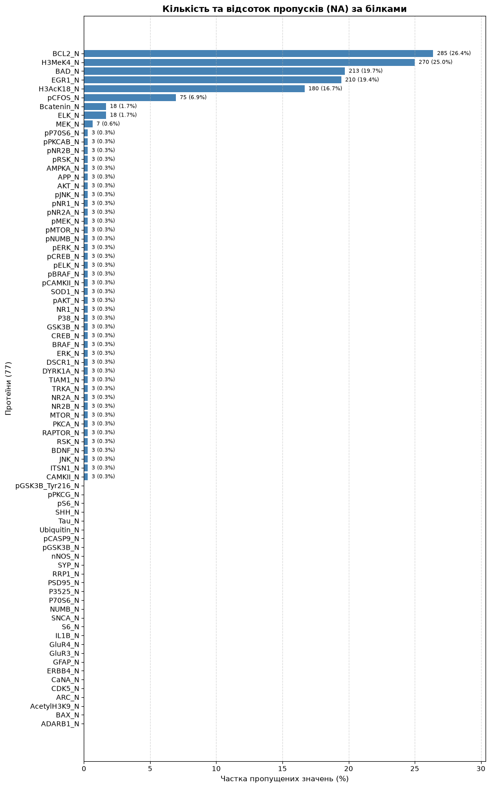
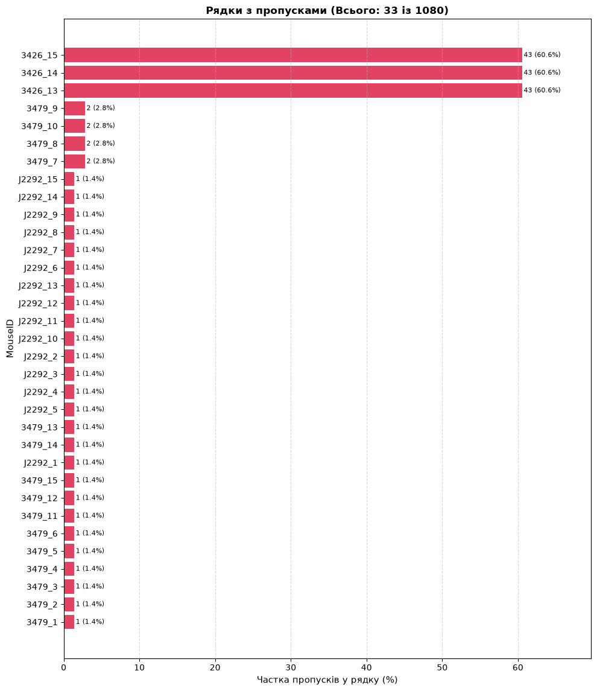
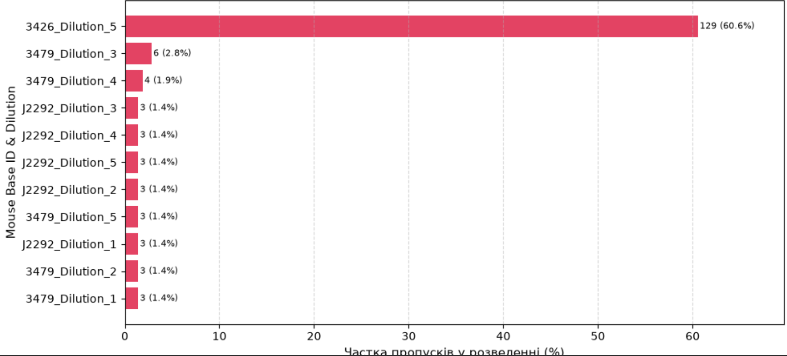
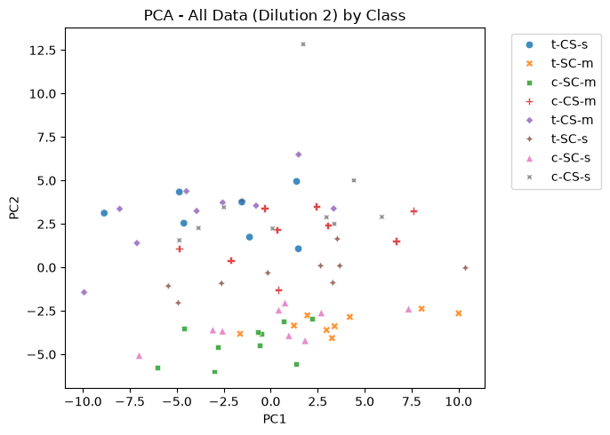
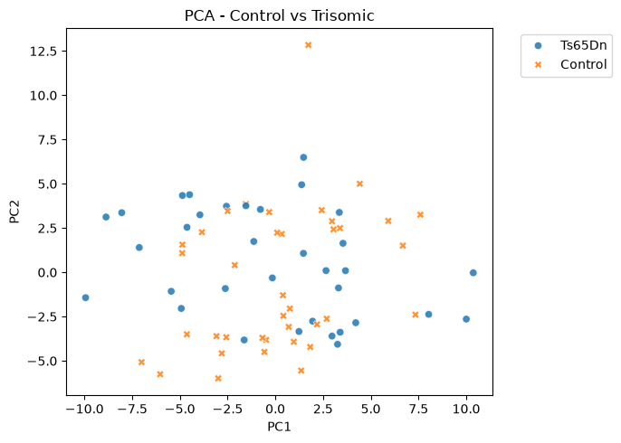
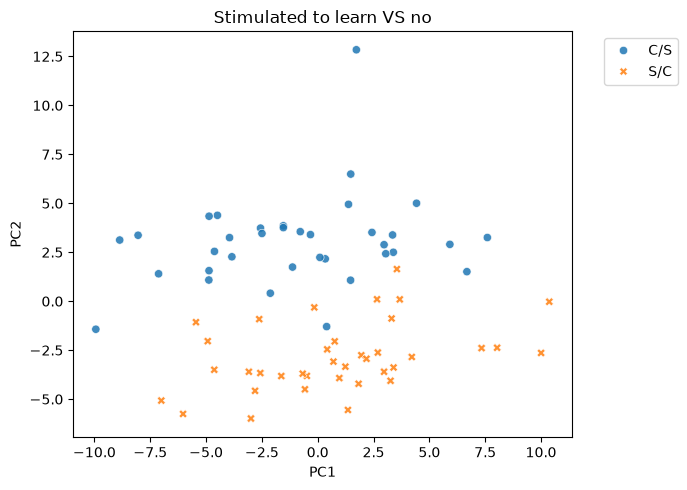

# Exploratory analysis
### Metadata

The original shape of the dataset before cleaning and filtering was 1080 rows and 82 columns, 5 of which were
metadata ('MouseID', 'Genotype', 'Treatment', 'Behavior', 'class') and the rest 77 - proteins. All metadata did not contain missing values. The distribution in terms of 'Genotype', 'Treatment' classes is approximately even - 570/510. 'class' contains 8 categories depending on the genotype (Control/Ts65Dn), whether a mouse had stimulation to learn (CS/SC), the drug (Memantine/Saline) injected and the outcome (learning/ no learning). The distribution between the classes is well balanced, as they are represented with approximately the same number of replicates ranging from 105 to 150.

### Unique ID and replicates

The inspection if unique ID 'MouseID' revealed that for each mouse there is a number of technical replicates, corresponding to 5 different dilutions for each protein. For each dilution there were 3 measurements. The dataset contains 72 mice - the number of replicates (15, 3 per each of 5 dilutions) and metadata were consistent across all organisms.

### Missing values & Cleaning
As for unexpected values in proteins columns, there were 1396 missing values and 1 negative value. I assumed that the distribution if NAs might not be even among all mice and proteins. Moreover, not necessarily the protein column or the organism may be problematic, but a certain dilutions with very high or low concentration may cuase technical difficulties in terms of measurent and generate more NAs than the other dilutions with moderate concentration. To check this assumption, I have created the following plots, that show number and proportion of missing values per protein, per mouse (after removing poorly measured proteins), and per dilution (after removing poorly measured proteins):

There are only several problematic proteins with NA% > 5, namely **'BCL2_N', 'H3MeK4_N', 'BAD_N', 'H3AcK18_N', 'pCFOS_N', 'EGR1_N'**, which were removed. This step has reduced total NAs from 1396 to 163 in only 3 mice. 

After calening poorly represented proteins, similarly, only several replicates of certain mice ('3426', '3479', 'J2292') were responsible for the majority of the missing values in the dataset. The most important findings are the followiing:
 - 3425 5th dilution is problematic for many proteins - NAs are ~ evenly distributed across proteins;
 - for mouse 3479 ELK_N was not measured at all; MEK_N's dilution 3 is problematic
 - for mouse J2292 Bcatenin_N was not measures at all

In this case choosing between proteins or samples removing, reduction of fetures is less harmful because p > n. So with 3 samples where NAs are sill present, the strategy is the following:
 - among 5 dilutions, we definitely should not pick 5th, because it will lead to losing 3425. Chosing 1-4 dilutions will save 3425 in the dataset
 - 3479 will be preserved if we delete ELK_N and avoid dilution 3
 - J2292 will be preserved if Bcatenin_N is deleted

Removing ELK_N, Bcatenin_N and avoid dilutions 3 and 5 saves all mice. **As a result 2 additional proteins were removed and among 5 dilutions diluton2 was selected for the further analysis.** In addition, 3 replicates for each mouse are not independent and may cuase poor generalization if its not considered while splitting and training, so proteins  will be represented as means of their 3 measurements within dilution 2, removing all replicates and retaining only 1 row per 1 mouse.

- 69 proteins out of 77 retained;
- Total missing cell values: 0;
- Duplicates (protein levels before averaging): 0;
- Dataset without replicates: (72, 77).

### Relationships/patterns inside dataset

In order to check whehter the obtained datasets has unexpected clusterring caused by batch effects, I have generates 3 PCA plots, where samples are colored by class, be genotype and by behavior.
