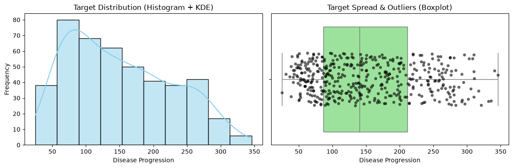
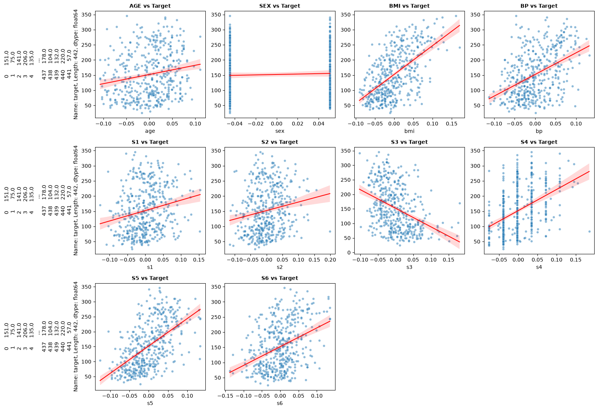
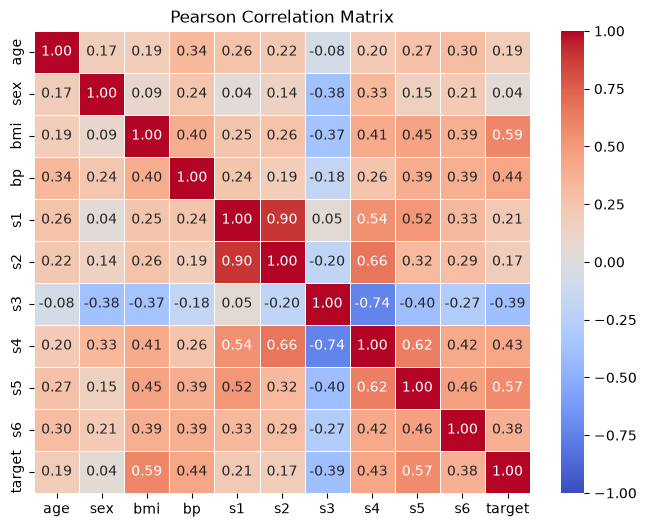
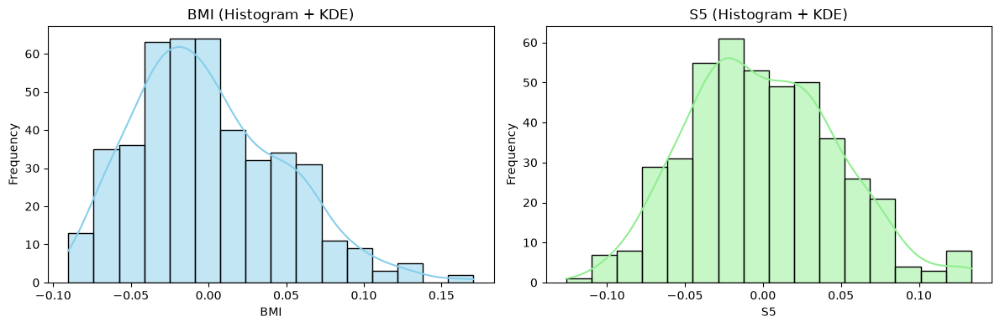
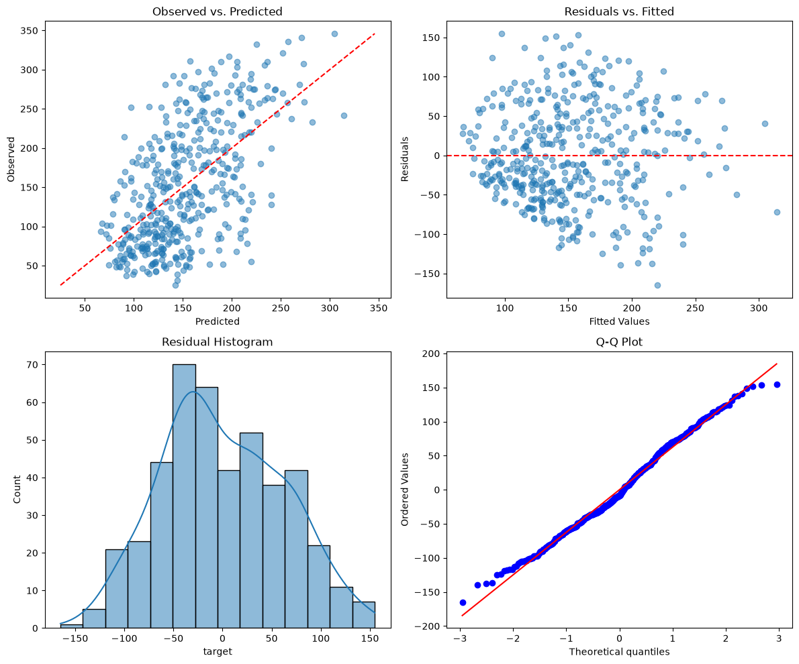

### Data Presentation
The dataset contains 442 observations and 11 columnes, one of which is target of the prediction and the rest 10 - features/predictors. One observation contains age, BMI, blood pressure, total serum cholesterol (s1), low-density lipoproteins (s2), high-density lipoproteins (s3), total cholesterol (s4), log of serum triglycerides level (s5), blood sugar level (s6). According to the dataset description, these 10 features were mean centered and scaled by the standard deviation times the square root of number of samples. 

### Descriptive Analysis
Target (disease progression measure) is a numeric variable, ranging fron 25 to 346. The probablilty density function is moderately right-skewed; Most observations have target value of 70-150.

Boxblot did not reveal outliers, values seem to have approximately constant density across values within box.
Looks like the dataset was preliminarily cleaned from severe outliers (whiskers probably served as cutoffs).

To identify strong predictor for the target, I have visualized target-feature relationships for all 10 features. BMI and S5 (serum triglycerides) demonstrated the strongest linear relationships among all features, whaich are top candidates for linear regression.

### Correlation
Top Pearson - BMI (0.59)

Top Spearman - s5 (0.59)

The top correlated fetures results slightly differ across methods, despite correlation coefficients for top fetures are close. Although distributions are not perfectly normal (neither target nor BMI and S5), I decide to stick to Pearson top correlated feature, as this method highlights specifically strongest linear correlation, while Spearman measures monotonic correlation, which is not necessarily linear. Top Speraman correlation is S5, which is also top 2 Pearson feature. The fact S5 has higher coefficient in Spearman and lower in Pearson may indicate less linearity and/or normality.

### Simple Regression
Intercept, 152 - expected disease progression value when predictor (BMI) is zero, meaning average.

Slope is large, 949, indicating strong positive correlation with disease progression, strong per-unit change. It needs mentioning that the ranges of target and BMI are different - target ranges from 25 to 346, while BMI from -0.09 to 0.17. So changing per 1 of BMI will lead to a large change in target.

### Residual Diagnistics
Predictions are not perfect, but center around red line, as expected. Residuals are homoscedastic and follow apploxinately normal distributions with slightly heavy tails, as displayed on KDE and Q-Q plot.

### Multiple Regression

Multiple Regression Coefficients:
- age   -10.009866
- sex  -239.815644
- bmi   519.845920
- bp   324.384646
- s1  -792.175639
- s2   476.739021
- s3   101.043268
- s4   177.063238
- s5   751.273700
- s6    67.626692

BMI and s5 (triglycerides) are the strongest positive contributing factors. Blood pressure also positively affects disease progression, although its magnitude is relatively moderate. 

Age and blood sugar (s6) have low magnitude negligible effect on the disease progression. 

To my mind, relatively strong effect of sex (-239) does not reflect biological reality and may be an statistical artifact due to the encoding. The range of sex variable is << 1 (male/female -0.0476; female/mail +0.0506) and, probably, this explains why the coefficient is so large. Indeed, rerunning fitting with rescaled sex values (0 and 1) led to changing the corresponding regression coefficient to -22.859648, which looks like more realistic and intuitive, meaning the contribution of sex is minimal.

Total serum cholesterol (s1), low-density lipoproteins (s2), high-density lipoproteins (s3), total cholesterol (s4) have moderate to large coefficients and, interestingly s1 has negative and the largest value. This can be explained by multicollinearity, bacuse these features are not independent - total cholesterol includes both LDL and HDL, which violates core assumption of linear regression. 

### Train/Test Evaluation

| Model | MAE | MSE | RMSE | R2 |
| :--- | :--- | :--- | :--- | :--- |
| **Simple Regression** | 52.259976 | 4061.825928 | 63.732456 | 0.233350 |
| **Multiple Regression** | 42.794095 | 2900.193628 | 53.853446 | 0.452603 |

Overall, multiple regression performed better across all metrics. Predicted by multiple regression values are generally closer to actual ones. In addition, multiple regression has explained almost twice more variance than simple regresion, but the achieved score is still not as strong.
- MAE shows average difference between predicted and actual value.
- MSE - squared difference between predicted and actual values, penalizes large distances more
- RMSE - square root of MSE, nrings it to original units
- R^2 - proportion of total variance explained by model's predictors.

